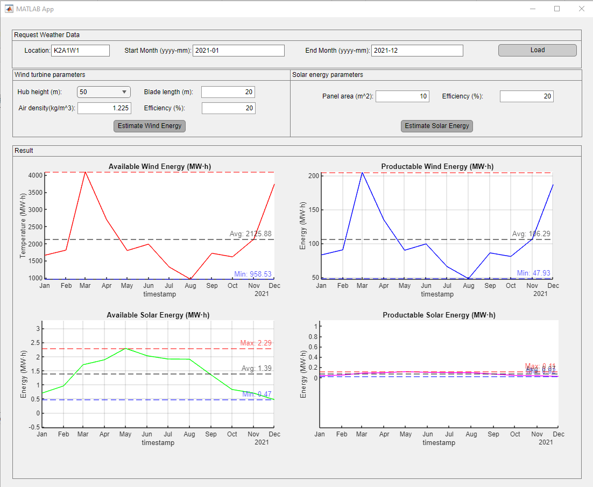

# Renewable Energy Estimation App with Matlab: An application for Renewable Energy Estimation made by Matlab

## Table of Contents
* [Introduction](#introduction)
* [Running App](#running-app)
* [Documentation](#documentation)
* [Contact](#contact)
* [License](#license)

## Introduction
The app estimate the renewable energy based on the weather data fetched from [Weather Data API](https://www.visualcrossing.com/weather-api).

## Running App
You can run the app by runnning [main.mlapp] in the root folder.

## Documentation
* After running the app, you have to load the weather data of the specific area in the certain period from the API. And then, you can estimate the wind energy or solar energy by the given generator.

* You can see the graph of the availabe wind energy and solar energy in that area. Also, you can see the renewable energy you can produce in that area.

## Contact
I hope to work with you. If you have any projects, you can contact me via Skype ID [live:.cid.b8144cf89d38b550]. I can help you in many areas including software development, web development and simulation. Thanks for your attention.

## License
[GNU GPL](LICENSE.txt)
